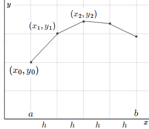
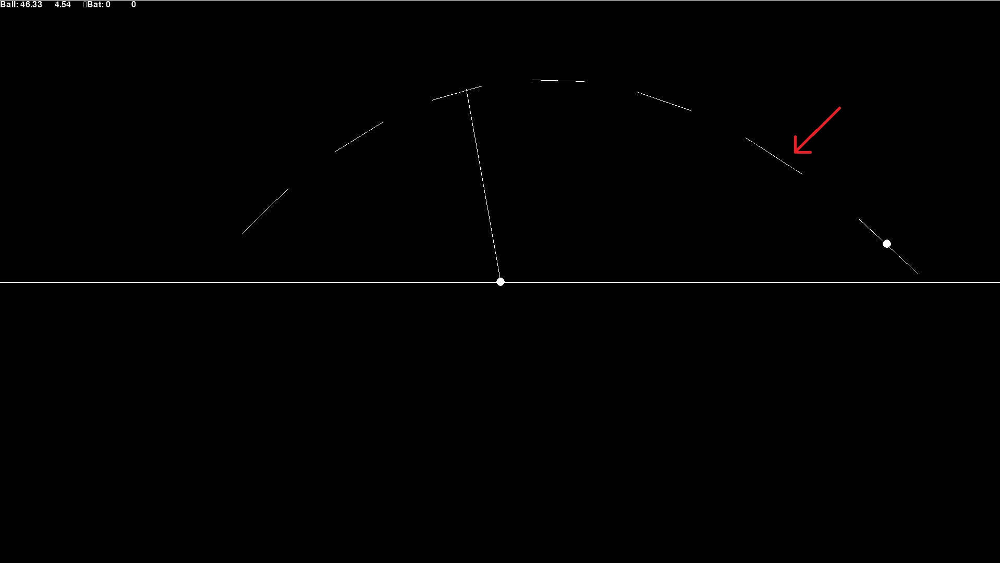
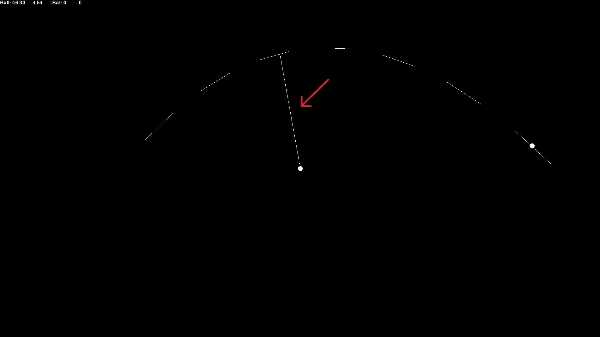
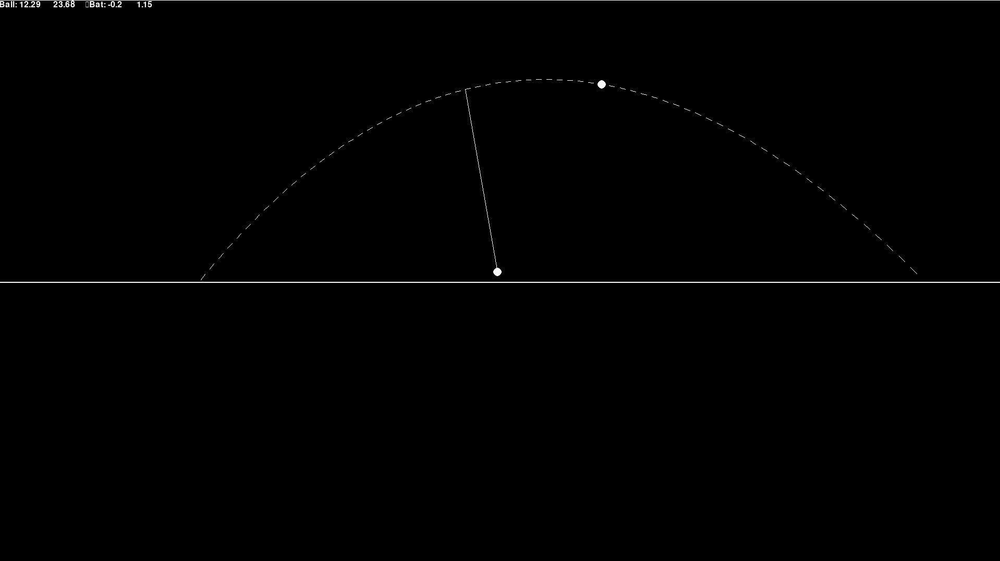
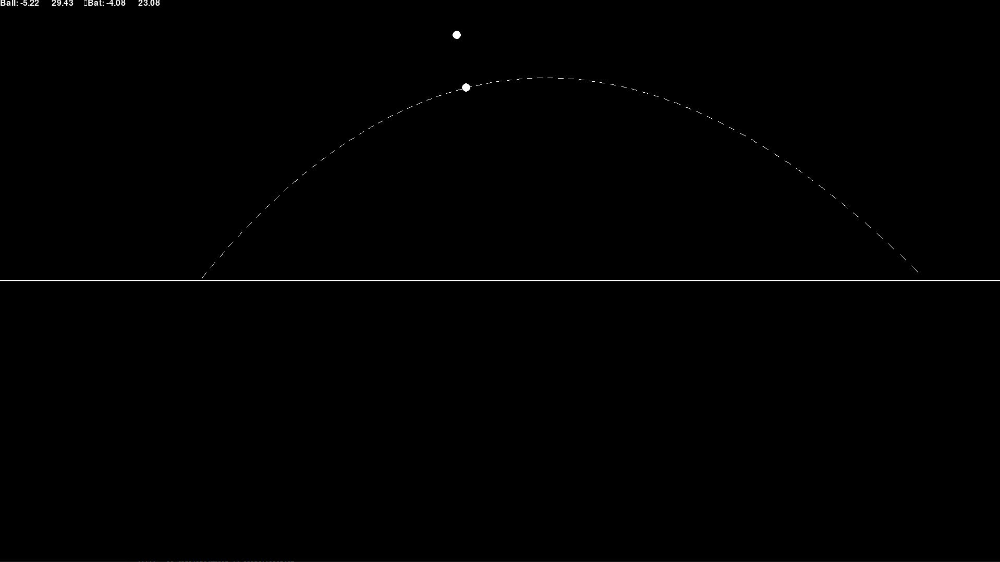

# Interjecting a body's movement arch and striking it<br/>(or: "Baseball practice")<br/>Grade: E or higher

## Basics

### Links

- [Repo](https://github.com/GammaEpsilon/DD1354_Project)
- [Blog](https://github.com/GammaEpsilon/DD1354_Project/wiki/Blog)

### Summary

The aim of this project was to simulate a baseball bat striking a ball being thrown. The problem consists of four different sub-problems; Simulating the ball's original movement, intercept this movement, applying the new forces to the bodies in the simulation and run the remainder of the simulation until exit the condition satisfies (which is, at the moment of writing this, the ball having no movement on the vertical axis). Forces affecting the ball are gravitational acceleration, air resistance and a original velocity, while the force affecting the bat is a constant acceleration. The projects ability to run in real time is dependant on the time-step interval set, the simulation will attempt to run in real time, and will run as fast as possible if unable to. The project is implemented in Python 3 using Pygame for visualization. Project has been developed on Python version 3.9.0 to be more specific.

### Example image

Figure 1: Example image

## Problem and theory

### Gravitational acceleration

A body falling within through the atmosphere is subjected to the two external forces, the gravitational force and the drag force. The gravitational causes the body to accelerate towards the ground at 9.8m/s<sup>2</sup> and the drag force applied to the object is equal to C<sub>d</sub>\*(A/2)\*r\* V<sup>2</sup>, where C<sub>d</sub> is the drag coefficient, A is the area the drag is affecting, r is the air density and V is the current velocity of the object.<sup>[1](https://www.grc.nasa.gov/www/k-12/VirtualAero/BottleRocket/airplane/falling.html)</sup> A is hardcoded to 0.5, C<sub>d</sub> is hardcoded to 0.47<sup>[2](https://en.wikipedia.org/wiki/Drag_coefficient)</sup> For the ball in the simulation.

### Math

The code uses the 2D rotation matrix for rotating forces in the simulation. To rotate a 2D vector for the angle v, multiply it with the vector:<sup>[3](https://en.wikipedia.org/wiki/Rotation_matrix)</sup>

|   cos(v)   |  -sin(v)  |
|    :---:   |  :---:    |
| **sin(v)** | **cos(v)**|

The code uses trigonometry for calculating required angle. It uses the function arctan, which returns the angle between the two catheli<sup>[4](https://en.wikipedia.org/wiki/Trigonometric_functions)</sup>.

### Time stepping

Time stepping algorithms can be used to solve differential equations. These algorithm solves the value of the next iteration based on current values. The algorithm currently integrated in the simulation is *explicit euler*. This algorithm is based on the Taylor series and works by summing the current value with it's derivative multiplied by the time-step interval.<sup>[5](https://www.intmath.com/differential-equations/11-eulers-method-des.php)</sup>

<br>Figure 2: An differential equation plotted with explicit euler (From: https://www.intmath.com/)

Another type of time stepping algorithms is *Runge-Kutta* algorithms, which has different heights of order. These algorithms has higher convergence rate than explicit euler and is therefore more accurate for higher step intervals and therefore more effective. The formula for Runge-Kutta Order 4 is
> y(x+h) = y(x)+6<sup>-1</sup>*(F<sub>1</sub>+2F<sub>2</sub>+2F<sub>3</sub>+F<sub>4</sub>)

where
>f is the differential equation<br>
>h is time-step interval<br>
>F<sub>1</sub> = hf(x,y)<br>
>F<sub>2</sub> = hf(x+h/2,y+F<sub>1</sub>/2)<br>
>F<sub>3</sub> = hf(x+h/2,y+F<sub>2</sub>/2)<br>
>F<sub>4</sub> = hf(x+h,y+F<sub>3</sub>)<br>

### Transferal of forces

The transferal of forces between the ball and bat is modelled in adherence to Newton's laws of motion. These laws are 
1. "An object at rest will stay at rest, and an object in motion will stay in motion unless acted on by a net external force."
2. "The rate of change of momentum of a body over time is directly proportional to the force applied, and occurs in the same direction as the applied force."
3. "all forces between two objects exist in equal magnitude and opposite direction: if one object **A** exerts a force **F<sub>A</sub>** on a second object **B**, then **B** simultaneously exerts a force **F<sub>B</sub>** on **A**, and the two forces are equal in magnitude and opposite in direction: **F<sub>A</sub> = −F<sub>B</sub>**."

The second law can be express as **F**=ma for constant mass objects and systems. Knowing this we can calculate the acceleration of the objects post collision with a=F/m. The third law, that **F<sub>ball</sub>**=**-F<sub>bat</sub>** is also important for the simulation model.<sup>[6](https://en.wikipedia.org/wiki/Newton%27s_laws_of_motion)</sup>

### Interception of moving objects

A moving object can be intercepted by letting the "pursuing"-actor compute an angle such that it will reach the "target"-actor at the specified destination. The pursuing actor must know, or at least approximate, its own and the target's velocity, and the targets direction.<sup>[7](https://www.researchgate.net/publication/6530533_Behavioral_dynamics_of_intercepting_a_moving_target)</sup>

## Implementation

### Movement and velocity

The movement of respective body is simulated using the time-stepping algorithm explicit euler using the velocity of each body as the derivative. The velocity of each step is also calculated using explicit euler. The forces affecting the ball's velocity is the gravitational pull downwards and the air resistance, while the force affecting the bat is an constant acceleration. The bat being unaffected by gravitational pull and air resistance is intentional design under the assumption that the bat swinger can accurately counteract these forces.

There was plans to implement more time-stepping algorithms than explicit euler, but this idea has been scrapped (at least for the project submission) due to time constraints.

### Angle of bat

Firstly we run the simulation for the original movement arch or the ball. Then the user may choose any point of this arch to intercept. The angle of the bat will then be calculated using trigonometry, more specifically using the arctangent function on the differences of the bat's and collision point's coordinates. A little more software trickery are used to correct for -pi/2 < arctangent(x) < pi/2. The whole functions is:

```py
def set_angle(self, cx, cy):
    try:
        self.angle = pi*int((cx-self.x)<0)-atan((cy-self.y)/(cx-self.x))
    except ZeroDivisionError:
        self.angle = -self.__sign__(cy-self.y)*(pi/2)
```

where self is the bat and cx, cy is the collision coordinates

<br>Figure 3: Arrow is pointing at original arch of the ball

<br>Figure 4: Arrow is pointing at the path the bat will take 

### Start time of bat

The start time of the bat is calculated by running the stepping algorithm for the bat before the "main" run, similarly to the original movement arch for the ball. This run is terminated when the bat's next position is further away from the collision point than the current iteration. Knowing how many iterations it takes to reach the the target destination, we can calculate that the iteration where the bat should start moving is the iteration where the ball reaches the collision point subtracted by iterations taken by the bat to reach the collision point. The actual implementation is:

```py
def turn_init(self, cp_index):

    # Code omitted

    while distance_from_collisionpoint(next := (localbat.x, localbat.y)) < distance_from_collisionpoint(old): # Run until we have found collision point by checking for sign-change
        localbat.accelerate(self.timestep)
        localbat.move(self.timestep)
        old = next
        iterations += 1
    if iterations > cp_index:
        raise ValueError("Bat can't reach this point if starting at the same time or later as ball")
    self.bat_start_travel_timepoint = cp_index-iterations

    # Code omitted

```

The implementation currently throws an exception if the iterations taken for the bats is longer than the iterations taken for the ball. This if for two reason:

1. It is a conscious decision since it seems unrealistic that the "striker" could predict where the ball will be before the ball starts moving.
2. The current implementation of state-machine within the simulation can not handle an dynamic order of events, e.g. all events must happen in a specific order.

<br>Figure 5: Bat starts to move to reach the collision point at the same time as ball 

### Collision

The collision occurs at the iteration specified by the user during the selection of collision point. During the collision the bat and the ball apply forces to each other in adherence to Newton's second and third law of motion. That is, both bodies accelerates (increases the velocity vector) each other in adherence to the second law, a = F/m, and both these forces has an "reacting" force on themselves. The forces has an hard-coded elasticity variable. Implementation follows:
```py
def __collide__(self):
    ball_force = self.ball.mass*self.ball.vx*self.elasticity, self.ball.mass*self.ball.vy*self.elasticity
    bat_force = self.bat.mass*self.bat.vx*self.elasticity, self.bat.mass*self.bat.vy*self.elasticity
    self.bat.apply_force(*tuple(map(lambda x: x/self.bat.mass, ball_force))) #Action
    self.ball.apply_force(*tuple(map(lambda x: x/self.ball.mass, bat_force)))
    self.ball.apply_force(*tuple(map(lambda x: -x/self.ball.mass, ball_force))) #Reaction
    self.bat.apply_force(*tuple(map(lambda x: -x/self.bat.mass, bat_force)))
    self.bat.set_angle(self.bat.x - self.bat.vx, self.bat.y - self.bat.vy)

```

<br>Figure 6: Screenshot taken directly after collision 

## Limitations

### 2D environment

This simulation is, obviously, implemented only in 2D, while this would in reality, obviously, again, occur in 3D. The current implementation would not be too cumbersome to extent to 3D however; the time-stepping algorithm would remain the same (but with 3 variables instead of 2) and the only simulation code that would have to be updated is the code for calculating the angle of the bat. Updating the visualization would however be more difficult.

### Oversimplification of bat

The striking of the ball in this simulation is actually more akin to giving the ball a straight punch rather than actually swinging a bat at it. This is due to the body colliding with the ball is just moving straight towards it. A more realistic representation of a baseball bat would have in addition to movement an angular momentum and length.

### State-tracking

The simulation currently has an set order of states in the simulation, e.g. the events of the simulation are not dynamic. This:

1. Has caused problems when implementing new events of the simulation, especially when the events may occur in different orders or an arbitrary number of times. An example of this is the implementation of the ball bouncing, there's a "dirty hack" in the function manipulating the state-machine the achieve bouncing an arbitrary number of times, even though it is not the functions responsibility to manipulate the state-machine.
2. Would cause problems if this code was meant to implemented in an environment where event order would be hard to predict, for example: a video game.

### Limitations of explicit euler

The aim of the project was, as mentioned in the implementation section, to implement a multitude of algorithms. Explicit euler is however the only algorithm implemented at the moment. This causes rather unrealistic results for 
simulation with high timestep intervals. A Runge Kutta 4 implementation has been started:

```py
def runge_kutta4(self, timestep):
    def f(x, y):
        return y+timestep*x # WRONG
    xf1 = timestep*f(self.vx,self.vx)
    xf2 = timestep*f(self.vx+timestep/2, self.x+xf1/2)
    xf3 = timestep*f(self.vx+timestep/2, self.x+xf2/2)
    xf4 = timestep*f(self.vx+timestep, self.x+xf3)
    self.x += 6**-1*(xf1+xf2+xf3+xf4)
    yf1 = timestep*f(self.vy,self.vy)
    yf2 = timestep*f(self.vy+timestep/2, self.y+yf1/2)
    yf3 = timestep*f(self.vy+timestep/2, self.y+yf2/2)
    yf4 = timestep*f(self.vy+timestep, self.y+yf3)
    self.y += 6**-1*(yf1+yf2+yf3+yf4)
```

but the implementation of `f()` is incorrect.

### Limitations of development environment

This simulation is written in Python. Python is not a very fast language. This combined with that the code is not very well optimised results that the simulation becomes too slow to run in real time fairly quickly. Using powers of tens, the lowest interval the machine used for developing the simulation could run in real time were 10<sup>-4</sup>. Pygame, the graphics library used for the visualization, also seems to limited to visualize the simulation in 3D.

## Reflections

### Who did what?

This is a "one man"-project so I, Erik Hedlund, have written all the code in this repository. I have however used some Python standard libraries, most notably the math library for the trigonometric functions used. The Pygame library has been used for visualization.

### Challenges/Set backs

This project has taken a lot longer than expected in all honesty. I honestly thought when writing the project specification that the code for the simulation and the visualization would both have been written in an afternoon each. This has very much not been the case. While the physics simulated in this project isn't super sophisticated, writing from scratch still takes **a lot** of time. Also add the time it takes to debug to that.

A lot of time was wasted trying to create a user interface. This user interface wasn't meant to be anything fancy, just the bare minimum needed to test different values. This was after two afternoons of wasted time scrapped in a favor for a combination of a json file and console interface.

A lot of bugs cropped up during development because of the rushed writing of the code. Maybe taking it slow would have been more effective in the long run. But at the same time, sometimes it's really hard to realize the bug you've written before you see it in action.

### Application

This simulation is very simple, so without extensions it's pretty difficult to apply to an actual problem. The interception algorithm could be used as an basis for a counter-missile system, and I do actually believe that it is used in that way. Of course are those systems significantly more sophisticated, or at least I hope so.

If extended to 3D, the ball physics could be used for an actual baseball video game, since the algorithm has no problem running in real time for reasonable time step intervals. Don't know why you would write a game in Python though.

## References

1. https://www.grc.nasa.gov/www/k-12/VirtualAero/BottleRocket/airplane/falling.html
2. https://en.wikipedia.org/wiki/Drag_coefficient
3. https://en.wikipedia.org/wiki/Rotation_matrix
4. https://en.wikipedia.org/wiki/Trigonometric_functions
5. https://www.intmath.com/differential-equations/11-eulers-method-des.php
6. https://en.wikipedia.org/wiki/Newton%27s_laws_of_motion
7. https://www.researchgate.net/publication/6530533_Behavioral_dynamics_of_intercepting_a_moving_target

## Inspirations

1. [Collision between two bodies (No code available)](https://ophysics.com/e2.html)
2. [Simulation of the arch travelled (No code available)](https://phet.colorado.edu/sims/html/projectile-motion/latest/projectile-motion_en.html)

<div style="page-break-after: always; visibility: hidden"> 
\pagebreak 
</div>

## Appendix

### Project Specification

[Project specification](ProjectSpecification.md)